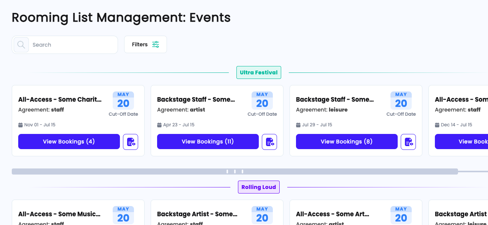
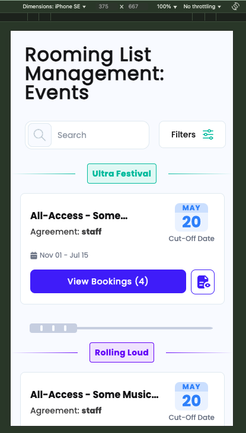
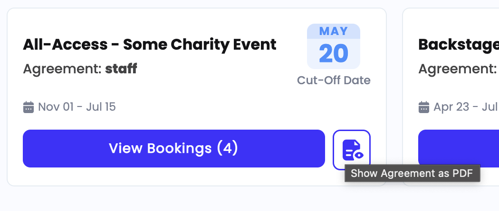
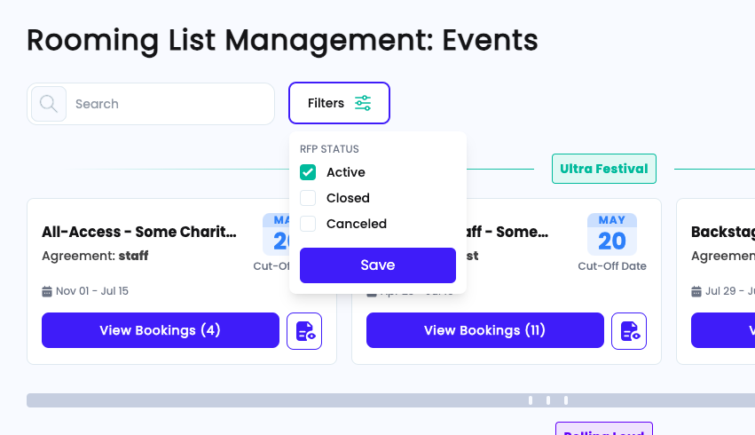
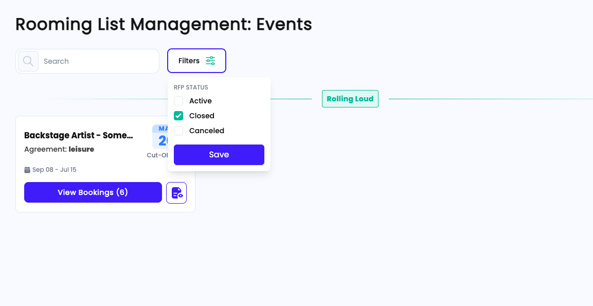
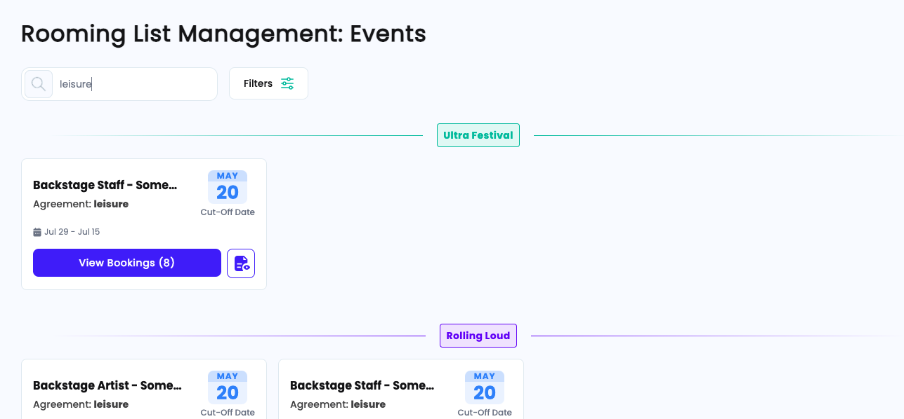

# Rooming List Panel

This is a **Next.js + TypeScript** project designed for managing rooming lists efficiently. It features a clean UI built with **Tailwind CSS** and follows an **atomic design pattern** to organize components.

## 📸 Screenshots

### Rooming List Management Panel View in HD screen


### Rooming List Management Panel View in mobile


### Show Agreement Tooltip


### Filters Button Clicked with Dropdown Menu Opened


### Filters Button Clicked with Closed Selected


### Search Engine


### Scroll Bar and Responsive Behavior
The scroll bar will appear whenever the cards row does not fit within the screen. Initially, the requirement was to display it only when there were more than 3 cards, but instead, the implementation was made fully responsive to ensure a better user experience. The page is also fully optimized for mobile.

### Clickout Behavior for Filter Menu
If the filter menu is opened and the user clicks outside of it without saving, the menu will close automatically, ensuring a clean and intuitive UI experience. When the menu is open again, the values not saved will be erased.

### Filter Logic
The filter checks for values in `status_id`. The test data provided did not include matching values for the expected filters (`active (received)`, `closed (completed)`, and `cancelled (archived)`). To address this, some values were modified to align with the filters. If needed, adjusting the values the filter works with is straightforward.

## 🚀 Features
- **Next.js 13+** (App Router)
- **TypeScript** for type safety
- **Atomic Design** structure (atoms, molecules, organisms, templates)
- **Tailwind CSS** for styling
- **Custom Scrollbar** with `tailwind-scrollbar`
- **Modular Components** (Event Cards, Filters, Search Bar)
- **JSON Data Handling** (Test Data in `data/` directory)
- **Reusable Utility Functions** (`utils/` directory)

## 📂 Project Structure
```
rooming-list-panel/
│── public/                   # Static assets (favicon, images)
│── src/
│   ├── app/                   # Next.js app router (layout.tsx, page.tsx)
│   ├── components/            # UI components
│   │   ├── atoms/             # Smallest UI elements (buttons, inputs)
│   │   ├── molecules/         # Components combining atoms (cards, headers)
│   │   ├── organisms/         # More complex UI components (event lists)
│   │   ├── templates/         # Page-level layouts
│   ├── data/                  # Test JSON data
│   ├── styles/                # Tailwind-based component styles
│   ├── utils/                 # Utility functions (formatting, filtering)
│── .gitignore                 # Git ignored files
│── package.json               # Dependencies and scripts
│── tailwind.config.ts         # Tailwind CSS configuration
│── next.config.ts             # Next.js configuration
│── README.md                  # Project documentation
```

## 🛠 Installation & Setup
### Clone the Repository
```sh
git clone https://github.com/YOUR_GITHUB_USERNAME/rooming-list-panel.git
cd rooming-list-panel
```

### Install Dependencies
```sh
npm install
```

### Run the Development Server
```sh
npm run dev
```

### Open in Browser
Visit [http://localhost:3000](http://localhost:3000) to see the app in action.

## 📦 Dependencies
- **Next.js** – React framework
- **TypeScript** – Static typing
- **Tailwind CSS** – Utility-first styling
- **tailwind-scrollbar** – Custom scrollbar styling

## 🖌 Styling & UI Components
The project follows an **atomic design pattern**:

- **Atoms**: Smallest UI elements (buttons, text, inputs)
- **Molecules**: Groups of atoms (cards, headers)
- **Organisms**: Full sections of the UI (event lists)
- **Templates**: Page-level components

**Tailwind CSS** is used for styling, with component styles located in the `styles/` directory.

## 📜 Utility Functions
Located in `src/utils/`:

- `formatDate.ts` → Handles date formatting
- `filterUtils.ts` → Filters events based on search and status
- `statusMap.ts` → Maps event status IDs to readable labels

---

